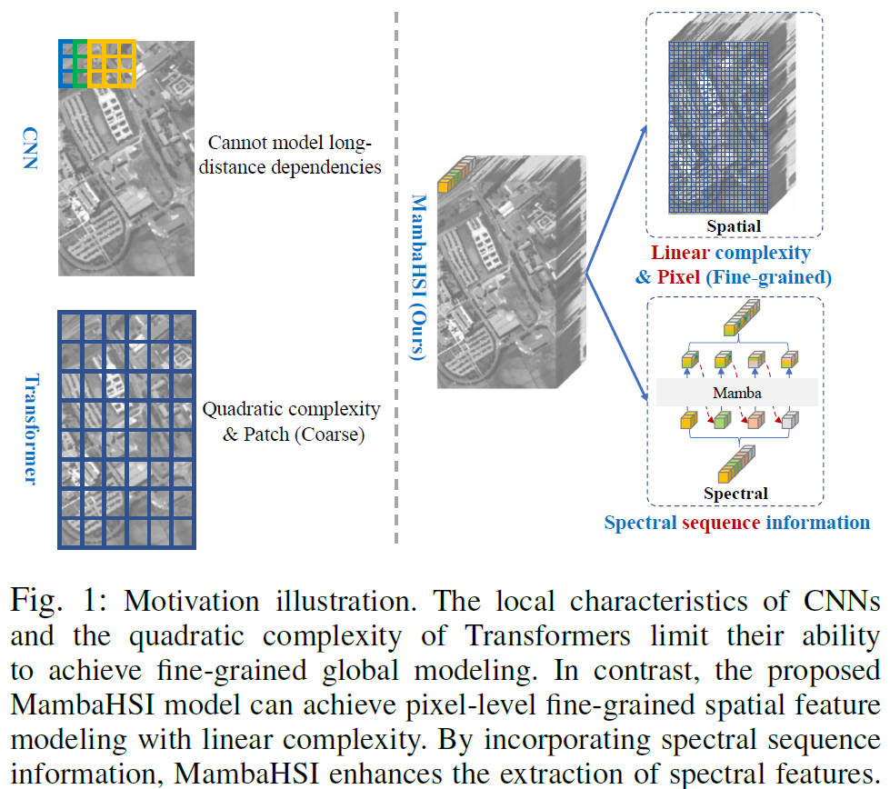

# MambaHSI: Spatial-Spectral Mamba for Hyperspectral Image Classification
<div align="center">

[Yapeng Li](https://scholar.google.com/citations?user=kkuoU8oAAAAJ&hl=zh-CN), [Yong Luo](https://scholar.google.com/citations?user=zb1oVGIAAAAJ&hl=zh-CN&oi=ao), [Lefei Zhang](https://scholar.google.com/citations?user=BLKHwNwAAAAJ&hl=zh-CN&oi=ao), [Zengmao Wang*](https://scholar.google.com/citations?user=tTqiJpQAAAAJ&hl=zh-CN&oi=ao), [Bo Du*](https://scholar.google.com/citations?user=Shy1gnMAAAAJ&hl=zh-CN)

</div>

<div align="center">
<a href='https://ieeexplore.ieee.org/abstract/document/10604894'></a>

</div>

## 📝 Introduction
<div align="center">

</div>

* To our best knowledge, the MambaHSI is **the first image-level hyperspectral image classification model based on SSM**, which can simultaneously model long-range interaction of whole image and integrate spatial and spectral image information.
* MambaHSI demonstrates **the great potential of Mamba to be the next-generation backbone for hyperspectral image models**.

## 🚀 Getting Started

### Installation

```sh
conda create -n MambaHSI_env python=3.9
conda activate MambaHSI_env
conda install pytorch==1.13.1 torchvision==0.14.1 torchaudio==0.13.1 pytorch-cuda=11.7 -c pytorch -c nvidia
pip install packaging==24.0
pip install triton==2.2.0
pip install mamba-ssm==1.2.0
pip install spectral
pip install scikit-learn==1.4.1.post1
pip install calflops==0.3.2
```

### Data Preparation
The dataset can download [Google Drive](https://drive.google.com/file/d/1d-fzMXYhpwis9o_x8hPz4uHx0z5tg7LD/view?usp=sharing) and [BaiduNetdisk](https://pan.baidu.com/s/1SqzP-Y6mbuR1PRz9uGGp1Q?pwd=8ne2).

```
data
└── UP/
    ├── PaviaU.mat 
    └── PaviaU_gt.mat
    ...
└── Houston/
    ├── Houston.mat 
    └── Houston_GT.mat
    ...
└── HanChuan/
    ├── WHU_Hi_HanChuan.mat 
    └── WHU_Hi_HanChuan_gt.mat
    ...
└── HongHu/  
    ├── WHU_Hi_HongHu.npy
    └── WHU_Hi_HongHu_gt.npy
```


**Training:**
```
python train_MambaHSI.py --dataset_index 0
python train_MambaHSI.py --dataset_index 1
python train_MambaHSI.py --dataset_index 2
python train_MambaHSI.py --dataset_index 3
```

## 🎖️ Main Results
<details open>
<summary><font size="4">
Pavia University Results
</font></summary>

</details>

<details open>
<summary><font size="4">
Houston Results
</font></summary>

</details>

<details open>
<summary><font size="4">
HanChuan Results
</font></summary>

</details>

<details open>
<summary><font size="4">
HongHu Results
</font></summary>

</details>

## Citation	

If you find this project helpful for your research, please kindly consider citing our paper and give this repo ⭐️: 

```
@ARTICLE{MambaHSI_TGRS24,
  author={Li, Yapeng and Luo, Yong and Zhang, Lefei and Wang, Zengmao and Du, Bo},
  journal={IEEE Transactions on Geoscience and Remote Sensing}, 
  title={MambaHSI: Spatial-Spectral Mamba for Hyperspectral Image Classification}, 
  year={2024},
  volume={},
  number={},
  pages={1-16},
  keywords={Hyperspectral Image Classification;Mamba;State Space Models;Transformer},
  doi={10.1109/TGRS.2024.3430985}}
```

## Acknowledgement
Part of our MambaHSI framework is referred to [CVSSN](https://github.com/lms-07/CVSSN.git) and [SSFCN](https://github.com/YonghaoXu/SSFCN.git). We thank all the contributors for open-sourcing.